# E-commerce Data Warehouse with PostgreSQL

A complete SQL portfolio project that transforms a real-world e-commerce dataset into a documented analytical data warehouse.

The project demonstrates how to ingest raw transactional data, profile its quality, clean and normalize it, build a dimensional star schema, calculate business KPIs and perform advanced customer and product analyses with PostgreSQL.

## Project objective

The objective is to build a reproducible analytical pipeline capable of transforming a raw retail file into reliable business information.

The project answers questions such as:

- How much gross and net revenue was generated?
- How did revenue evolve month by month?
- Which countries contribute the most revenue?
- Which merchandise products perform best after cancellations?
- Which products are frequently cancelled?
- Which customers generate the most revenue?
- How important are repeat customers?
- How can customers be segmented using RFM analysis?

## Why this project matters

This repository is not only a collection of SQL queries.

It demonstrates an end-to-end data workflow:

    Online Retail Excel file
            |
            v
    Reproducible CSV conversion
            |
            v
    Raw PostgreSQL ingestion
            |
            v
    Data profiling and quality checks
            |
            v
    Typed and normalized staging layer
            |
            v
    Dimensional star schema
            |
            v
    Analytical views and business KPIs
            |
            v
    Advanced SQL analyses and documented insights

## Technologies

- PostgreSQL 16
- SQL
- Python 3
- openpyxl
- Git
- GitHub
- Mermaid

## Skills demonstrated

### Data engineering

- Raw data ingestion
- Layered data architecture
- Reproducible transformations
- Data lineage
- Data-quality profiling
- Type conversion
- Identifier normalization
- Transparent deduplication
- Dimensional modelling
- Surrogate keys
- Unknown dimension members
- Fact and dimension loading
- Referential integrity
- Index creation

### SQL analytics

- Aggregations
- Conditional aggregation with `FILTER`
- `CASE WHEN`
- Common table expressions
- Multi-table joins
- Subqueries
- Date analysis
- Window functions
- `ROW_NUMBER`
- `RANK`
- `DENSE_RANK`
- `LAG`
- `NTILE`
- Cumulative sums with `SUM() OVER`
- Customer segmentation
- RFM analysis

### Documentation

- Data dictionary
- Data-quality report
- Architecture diagram
- Business metric definitions
- Analytical assumptions
- Key business insights
- Reproducible execution instructions

## Dataset

The project uses the Online Retail dataset from the UCI Machine Learning Repository.

It contains transactions from a UK-based online retailer between:

- 1 December 2010;
- 9 December 2011.

The source dataset contains:

| Metric | Value |
|---|---:|
| Raw transaction rows | 541,909 |
| Distinct invoices | 25,900 |
| Distinct source product codes | 4,070 |
| Identified customers | 4,372 |
| Countries | 38 |

The complete source files are intentionally excluded from Git.

Dataset details, source attribution, integrity checksum and conversion instructions are available in:

[data/README.md](data/README.md)

## Architecture

The project follows four logical PostgreSQL layers.

| Layer | Purpose |
|---|---|
| `raw` | Preserve imported source values with minimal transformation |
| `staging` | Type, normalize, classify and enrich source transactions |
| `warehouse` | Store the dimensional star schema |
| `analytics` | Expose reusable views and business KPIs |

### Pipeline

    raw.online_retail
            |
            v
    staging.transactions
            |
            v
    warehouse.dim_customer
    warehouse.dim_product
    warehouse.dim_country
    warehouse.dim_date
    warehouse.fact_sales
            |
            v
    analytics views
            |
            v
    advanced analyses and business insights

The complete visual architecture is available in:

- [images/data_model.svg](images/data_model.svg)
- [docs/data_model.mmd](docs/data_model.mmd)

## Dimensional model

The central star schema contains:

| Table | Grain | Rows |
|---|---|---:|
| `warehouse.dim_customer` | One row per identified customer, plus an unknown member | 4,373 |
| `warehouse.dim_product` | One row per normalized product or operation code, plus an unknown member | 3,959 |
| `warehouse.dim_country` | One row per country, plus an unknown member | 39 |
| `warehouse.dim_date` | One row per calendar date, plus an unknown member | 375 |
| `warehouse.fact_sales` | One deduplicated source transaction line | 536,641 |

The full column-level documentation is available in:

[docs/data_dictionary.md](docs/data_dictionary.md)

## Data-quality findings

The source data required several documented transformation decisions.

| Observation | Result |
|---|---:|
| Missing customer identifiers | 135,080 rows |
| Missing descriptions | 1,454 rows |
| Negative quantity rows | 10,624 rows |
| Cancelled invoice rows | 9,288 rows |
| Negative quantities without cancellation prefix | 1,336 rows |
| Zero-price rows | 2,515 rows |
| Negative-price rows | 2 rows |
| Excess exact duplicate rows | 5,268 rows |

Important decisions include:

- preserving anonymous transactions for global revenue analysis;
- excluding anonymous transactions only from customer-level analyses;
- preserving all source rows in staging;
- loading only the first exact occurrence into the fact table;
- normalizing product codes to uppercase;
- separating merchandise from fees, vouchers and financial adjustments;
- measuring both gross and net product performance.

The detailed report is available in:

[docs/data_quality_report.md](docs/data_quality_report.md)

## Product normalization and classification

Product-code normalization reduced the number of distinct codes from:

    4,070 source codes
            |
            v
    3,958 normalized codes

A total of 112 references differed only by letter case.

For example:

    85123A
    85123a

are treated as the same product.

The product dimension also separates physical merchandise from operational codes.

| Category | Examples |
|---|---|
| `MERCHANDISE` | Standard retail products |
| `SHIPPING_FEE` | `DOT`, `POST`, `C2` |
| `FINANCIAL_ADJUSTMENT` | `AMAZONFEE`, `BANK CHARGES`, `D` |
| `MANUAL` | `M` |
| `SAMPLE` | `S` |
| `GIFT_VOUCHER` | Codes beginning with `GIFT_` |
| `UNKNOWN` | Unknown dimension member |

Non-merchandise codes remain available in the warehouse but are excluded from physical-product rankings.

## Analytical views

The `analytics` schema contains seven reusable views.

| View | Purpose |
|---|---|
| `v_sales_enriched` | Fact rows enriched with all dimensions |
| `v_order_summary` | One row per positive invoice |
| `v_kpi_overview` | Main business KPI summary |
| `v_monthly_kpis` | Monthly revenue, orders and cancellations |
| `v_country_kpis` | Country-level performance |
| `v_product_kpis` | Product sales, cancellations and net performance |
| `v_customer_kpis` | Customer recurrence and revenue metrics |

## Main KPIs

| KPI | Result |
|---|---:|
| Positive sale lines | 524,878 |
| Positive orders | 19,960 |
| Cancelled invoices | 3,836 |
| Identified purchasing customers | 4,338 |
| Gross revenue | 10,642,110.80 |
| Cancellation amount | 893,979.73 |
| Net revenue | 9,748,131.07 |
| Average order value | 533.17 |
| Cancellation invoice rate | 16.12% |

Monetary values are expressed in the source dataset currency.

## Key business insights

### Strong seasonal acceleration

Revenue increased substantially during the final complete months of 2011.

| Month | Gross revenue | Monthly growth |
|---|---:|---:|
| September 2011 | 1,056,435.19 | 39.40% |
| October 2011 | 1,151,263.73 | 8.98% |
| November 2011 | 1,503,866.78 | 30.63% |

December 2011 is incomplete because the dataset ends on 9 December.

### Geographic concentration

The United Kingdom generated approximately 84.59% of gross revenue.

Some international markets recorded particularly high average order values, including the Netherlands and Australia.

### Revenue depends heavily on repeat customers

Highly recurrent customers represent only 7.77% of identified purchasing customers but generate 49.33% of identified-customer revenue.

### RFM Champions dominate customer revenue

The RFM `CHAMPIONS` segment contains 948 customers and generates approximately 64.58% of identified-customer revenue.

### Gross product performance can be misleading

The product `PAPER CRAFT, LITTLE BIRDIE` recorded:

| Metric | Value |
|---|---:|
| Sold quantity | 80,995 |
| Cancelled quantity | 80,995 |
| Net quantity | 0 |
| Net revenue | 0.00 |

A gross-only ranking would incorrectly present it as a top-performing product.

The project therefore ranks merchandise using net quantity and net revenue.

More detailed conclusions are available in:

[results/key_insights.md](results/key_insights.md)

## Repository structure

    sql-ecommerce-analytics-postgresql/
    ├── README.md
    ├── requirements.txt
    ├── data/
    │   └── README.md
    ├── docs/
    │   ├── data_dictionary.md
    │   ├── data_model.mmd
    │   └── data_quality_report.md
    ├── images/
    │   └── data_model.svg
    ├── results/
    │   └── key_insights.md
    ├── scripts/
    │   └── convert_xlsx_to_csv.py
    └── sql/
        ├── 01_create_schemas.sql
        ├── 02_create_raw_table.sql
        ├── 03_import_data.sql
        ├── 04_data_quality_checks.sql
        ├── 05_create_staging.sql
        ├── 06_create_dimensions.sql
        ├── 07_create_fact_sales.sql
        ├── 08_create_views.sql
        └── 09_analysis_queries.sql

## How to run the project

### Prerequisites

- PostgreSQL 16 or a compatible recent version
- Python 3
- Git

### 1. Clone the repository

    git clone https://github.com/theodev23/sql-ecommerce-analytics-postgresql.git
    cd sql-ecommerce-analytics-postgresql

### 2. Create and activate the Python environment

On macOS or Linux:

    python3 -m venv .venv
    source .venv/bin/activate
    python -m pip install -r requirements.txt

### 3. Download the source dataset

Download `Online Retail.xlsx` from the UCI Machine Learning Repository and place it at:

    data/online_retail.xlsx

See [data/README.md](data/README.md) for the source and integrity checksum.

### 4. Convert the Excel file to CSV

    python scripts/convert_xlsx_to_csv.py

Expected output:

    Rows written including header: 541910
    Data rows: 541909

### 5. Create the PostgreSQL database

    createdb ecommerce_dw

### 6. Run the SQL pipeline

Run the commands from the repository root:

    psql -v ON_ERROR_STOP=1 -d ecommerce_dw -f sql/01_create_schemas.sql
    psql -v ON_ERROR_STOP=1 -d ecommerce_dw -f sql/02_create_raw_table.sql
    psql -v ON_ERROR_STOP=1 -d ecommerce_dw -f sql/03_import_data.sql
    psql -v ON_ERROR_STOP=1 -d ecommerce_dw -f sql/04_data_quality_checks.sql
    psql -v ON_ERROR_STOP=1 -d ecommerce_dw -f sql/05_create_staging.sql
    psql -v ON_ERROR_STOP=1 -d ecommerce_dw -f sql/06_create_dimensions.sql
    psql -v ON_ERROR_STOP=1 -d ecommerce_dw -f sql/07_create_fact_sales.sql
    psql -v ON_ERROR_STOP=1 -d ecommerce_dw -f sql/08_create_views.sql
    psql -v ON_ERROR_STOP=1 -d ecommerce_dw -f sql/09_analysis_queries.sql

The import script uses the relative path:

    data/online_retail.csv

It must therefore be executed from the repository root.

## Example queries

### Overall KPIs

    SELECT *
    FROM analytics.v_kpi_overview;

### Monthly revenue

    SELECT
        year_month,
        gross_revenue,
        cancellation_amount,
        net_revenue,
        average_order_value
    FROM analytics.v_monthly_kpis
    ORDER BY year_month;

### Top merchandise by net revenue

    SELECT
        stock_code,
        product_description,
        net_quantity,
        gross_revenue,
        cancellation_amount,
        net_revenue
    FROM analytics.v_product_kpis
    WHERE is_merchandise = TRUE
      AND net_revenue > 0
    ORDER BY net_revenue DESC
    LIMIT 10;

### Most valuable customers

    SELECT
        customer_id,
        order_count,
        gross_revenue,
        average_order_value
    FROM analytics.v_customer_kpis
    ORDER BY gross_revenue DESC
    LIMIT 10;

## Advanced analyses

The file `sql/09_analysis_queries.sql` contains:

- month-over-month revenue growth using `LAG`;
- country and product rankings using `DENSE_RANK`;
- the top merchandise product for each month using `ROW_NUMBER`;
- cumulative revenue contribution using `SUM() OVER`;
- one-time and repeat customer segmentation;
- cancellation-heavy product analysis;
- customer RFM scoring using `NTILE`.

## Reproducibility

The project is designed to be rerunnable.

Key scripts use:

- `CREATE ... IF NOT EXISTS`;
- controlled `TRUNCATE` operations;
- transactions;
- `ON_ERROR_STOP`;
- reproducible source conversion;
- deterministic product-description selection;
- documented deduplication rules.

## Limitations

- The dataset covers only one retailer.
- December 2011 is incomplete.
- The source does not provide product categories, costs or margins.
- Customer identifiers are absent for a significant number of transactions.
- Currency is not explicitly identified in the source columns.
- The RFM segmentation uses project-specific heuristic rules based on quintiles.
- Exact duplicates cannot always be proven to be technical errors, so they remain preserved in staging.

## Documentation

- [Dataset documentation](data/README.md)
- [Data-quality report](docs/data_quality_report.md)
- [Data dictionary](docs/data_dictionary.md)
- [Architecture diagram](images/data_model.svg)
- [Business insights](results/key_insights.md)

## Author

**Théo Devarenne**

This project was created as part of a professional transition toward data engineering and demonstrates practical SQL, PostgreSQL, data modelling and analytical skills.
